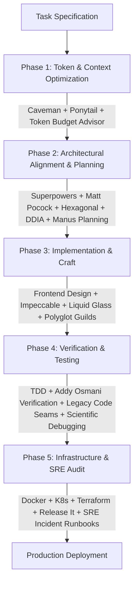

# All-in-One Skills for AI (`all-in-one-skills-for-ai`)

An enterprise-grade, curated suite of 100 production-ready AI Agent Skills compliant with the open [Agent Skills Specification](https://agentskills.io). Built for cross-harness compatibility across Claude Code, Cursor, Windsurf, GitHub Copilot CLI, Antigravity, Cline, and Codex.

---

## Architecture Overview

Modern AI coding agents face five core limitations:
1. **Context Exhaustion**: Unbounded reasoning loops and conversational filler waste token budgets and cause premature context truncation.
2. **Premature Abstraction**: Defaulting to third-party dependencies and over-engineered wrappers over native platform primitives.
3. **Aesthetic Drift**: Unstyled, generic user interfaces lacking typographic hierarchy, spatial rhythm, and responsive fluidity.
4. **Context Decay**: Loss of project state and architectural invariants across long-running sessions, causing plan drift and regressions.
5. **Operational Blindspots**: Shipping code without verifying database lock contention, low-latency allocations, container efficiency, security boundaries, or Kubernetes manifest health.

This collection provides a structured, multi-phase execution pipeline addressing each stage of the software lifecycle.



---

## Skill Directory & Attribution Index (100 Skills)

<details open>
<summary><b>1. Token Efficiency, Conciseness and Anti-Over-Engineering (15 Skills)</b></summary>
<br>

Focus: Strip conversational padding, minimize token burn, and enforce the "Lazy Senior Developer" YAGNI philosophy.

| Skill Identifier | Purpose & Capabilities | Upstream Author & Origin |
| :--- | :--- | :--- |
| `caveman` | Ultra-terse communication style. Strips filler words while preserving 100% technical substance. Reduces token consumption by 65% to 75%. | [Julius Brussee](https://github.com/JuliusBrussee/caveman) |
| `caveman-commit` | Formats dense, conventional git commit messages with zero conversational meta-commentary. | [Julius Brussee](https://github.com/JuliusBrussee/caveman) |
| `caveman-compress` | Compresses historical conversation context, tracebacks, and log dumps into structured, high-density briefs. | [Julius Brussee](https://github.com/JuliusBrussee/caveman) |
| `caveman-optimize` | Systematically audits prompts and context payloads to reduce multi-turn context expansion. | [Julius Brussee](https://github.com/JuliusBrussee/caveman) |
| `ponytail` | Enforces the "Ladder of Laziness" to stop over-engineering: YAGNI -> Codebase Reuse -> Standard Library -> Platform Native -> Minimal Diff. | [Dietrich Gebert](https://github.com/DietrichGebert/ponytail) |
| `ponytail-audit` | Audits codebases for dependency sprawl, oversized npm packages, and superfluous abstractions. | [Dietrich Gebert](https://github.com/DietrichGebert/ponytail) |
| `ponytail-debt` | Evaluates architectural debt and premature abstractions prior to feature development. | [Dietrich Gebert](https://github.com/DietrichGebert/ponytail) |
| `investigate-first` | Blocks immediate file mutations; mandates root-cause isolation and impact analysis prior to edits. | [Dietrich Gebert](https://github.com/DietrichGebert/ponytail) |
| `lean-build` | Minimalist build and bundle strategies prioritizing platform primitives and zero-dependency patterns. | [Dietrich Gebert](https://github.com/DietrichGebert/ponytail) |
| `safe-refactor` | Incremental refactoring guidelines ensuring backward compatibility and regression bounds. | [Dietrich Gebert](https://github.com/DietrichGebert/ponytail) |
| `surgical-patch` | Restricts code changes to atomic, localized line ranges rather than full-file rewrites. | [Dietrich Gebert](https://github.com/DietrichGebert/ponytail) |
| `verify-and-stop` | Defines deterministic criteria to cease agent execution once requirements are satisfied. | [Dietrich Gebert](https://github.com/DietrichGebert/ponytail) |
| `code-simplification` | Reduces code complexity, removes dead branches, and streamlines logic paths for readability. | [Addy Osmani](https://github.com/addyosmani/agent-skills) |
| `context-engineering` | Optimizes in-memory prompt structures and token distribution for complex agent tasks. | [Addy Osmani](https://github.com/addyosmani/agent-skills) |
| `token-budget-advisor` | Quantifies prompt cost impact, analyzes token allocation per file, and optimizes payload efficiency. | [Affaan Mustafa (ECC)](https://github.com/affaan-m/ECC) |

</details>

<details open>
<summary><b>2. UI/UX, Frontend Design Systems and Visual Craft (11 Skills)</b></summary>
<br>

Focus: Replace default AI aesthetics with intentional design systems, cohesive typography, and responsive fluidity.

| Skill Identifier | Purpose & Capabilities | Upstream Author & Origin |
| :--- | :--- | :--- |
| `frontend-design` | Overrides generic AI UI conventions; establishes distinct color palettes, font pairings, spatial tension, and layout systems. | [Anthropic](https://github.com/anthropics/skills) |
| `impeccable` | Award-winning design director toolkit covering 20+ specialized playbooks: audits, micro-interactions, typography, and polish. | [Paul Bakaus](https://github.com/pbakaus/impeccable) |
| `liquid-glass-design` | Advanced glassmorphism paradigms: backdrop blur layers, border reflections, fluid depth, and dark-mode lighting. | [Affaan Mustafa (ECC)](https://github.com/affaan-m/ECC) |
| `ui-ux-pro-max` | Comprehensive design intelligence database covering 57 UI paradigms, 95 industry palettes, and micro-interaction heuristics. | [NextLevelBuilder](https://github.com/nextlevelbuilder/ui-ux-pro-max-skill) |
| `design-system` | Generates tokenized CSS variables, typography ladders, fluid spacing scales, and reusable component contracts. | [NextLevelBuilder](https://github.com/nextlevelbuilder/ui-ux-pro-max-skill) |
| `ui-styling` | Production utility CSS and Tailwind configurations with responsiveness and dark-mode tokens. | [NextLevelBuilder](https://github.com/nextlevelbuilder/ui-ux-pro-max-skill) |
| `brand` | Enforces visual brand guidelines, asset dimensions, typography hierarchy, and tone consistency. | [NextLevelBuilder](https://github.com/nextlevelbuilder/ui-ux-pro-max-skill) |
| `banner-design` | Computes responsive layout hierarchies, visual weights, and hero asset specifications. | [NextLevelBuilder](https://github.com/nextlevelbuilder/ui-ux-pro-max-skill) |
| `browser-testing-with-devtools` | Automates Chrome DevTools inspection for layout shifts, accessibility defects, and render performance. | [Addy Osmani](https://github.com/addyosmani/agent-skills) |
| `react-patterns` | Idiomatic React composition: custom hook boundaries, state colocation, context splitting, and render optimizations. | Community Core |
| `nextjs-best-practices` | App Router architecture, React Server Components (RSC), boundary orchestration, and streaming data patterns. | Vercel / Next.js Ecosystem |

</details>

<details open>
<summary><b>3. High-Level Thinking, Architecture and Complex Planning (30 Skills)</b></summary>
<br>

Focus: Transform ad-hoc prompting into disciplined engineering methodology, persistent disk memory, and multi-agent execution.

| Skill Identifier | Purpose & Capabilities | Upstream Author & Origin |
| :--- | :--- | :--- |
| `brainstorming` | Explores problem spaces, evaluates architectural alternatives, and aligns requirements prior to coding. | [Jesse Vincent (obra)](https://github.com/obra/superpowers) |
| `writing-plans` | Formulates step-by-step technical blueprints with explicit verification criteria for each phase. | [Jesse Vincent (obra)](https://github.com/obra/superpowers) |
| `executing-plans` | Executes technical implementation plans sequentially, confirming passing states at every milestone. | [Jesse Vincent (obra)](https://github.com/obra/superpowers) |
| `subagent-driven-development` | Breaks down complex objectives and delegates atomic, isolated deliverables to specialized subagents. | [Jesse Vincent (obra)](https://github.com/obra/superpowers) |
| `dispatching-parallel-agents` | Coordinates concurrent execution threads for testing, static analysis, and documentation generation. | [Jesse Vincent (obra)](https://github.com/obra/superpowers) |
| `using-git-worktrees` | Isolates experimental features and agent scratchpads into dedicated git worktrees. | [Jesse Vincent (obra)](https://github.com/obra/superpowers) |
| `verification-before-completion` | Prohibits declaring a task complete without reproducible test or build evidence. | [Jesse Vincent (obra)](https://github.com/obra/superpowers) |
| `requesting-code-review` | Compiles focused, context-aware review packets detailing intent, changes, and verification proof. | [Jesse Vincent (obra)](https://github.com/obra/superpowers) |
| `receiving-code-review` | Systematically parses review comments and refactors code without defensive rationalization. | [Jesse Vincent (obra)](https://github.com/obra/superpowers) |
| `planning-with-files` | Implements persistent markdown memory (`task_plan.md`, `findings.md`) on disk to prevent memory decay. | [Othman Adi](https://github.com/OthmanAdi/planning-with-files) |
| `hexagonal-architecture` | Ports and Adapters architecture: decouples business domain core from driving and driven infrastructure adapters. | [Affaan Mustafa / Cockburn](https://github.com/affaan-m/ECC) |
| `latency-critical-systems` | Zero-allocation techniques, cache-line alignment, lock-free ring buffers, and batching heuristics for sub-millisecond systems. | [Affaan Mustafa (ECC)](https://github.com/affaan-m/ECC) |
| `philosophy-of-software-design` | John Ousterhout's principles: deep modules with simple interfaces, information hiding, and defining errors out of existence. | [Ciembor / Ousterhout](https://github.com/ciembor/agent-rules-books) |
| `pragmatic-programmer` | Craftsmanship principles: tracer bullets, orthogonality, broken windows, DRY, and deliberate engineering habits. | [Ciembor / Hunt & Thomas](https://github.com/ciembor/agent-rules-books) |
| `wayfinder` | Navigates unfamiliar codebases with architectural reconnaissance and dependency graphing. | [Matt Pocock](https://github.com/mattpocock/skills) |
| `to-spec` | Interrogates ambiguous product requirements and transforms them into strict, testable specifications. | [Matt Pocock](https://github.com/mattpocock/skills) |
| `to-tickets` | Decomposes technical specifications into atomic, dependency-sequenced engineering tickets. | [Matt Pocock](https://github.com/mattpocock/skills) |
| `domain-modeling` | Models domain entities, aggregate roots, value objects, and invariant boundaries under DDD principles. | [Matt Pocock](https://github.com/mattpocock/skills) |
| `codebase-design` | Establishes high-cohesion, low-coupling directory layouts and public interface contracts. | [Matt Pocock](https://github.com/mattpocock/skills) |
| `grill-me` | Interactive interview loop that challenges hidden assumptions and edge cases before implementation. | [Matt Pocock](https://github.com/mattpocock/skills) |
| `resolving-merge-conflicts` | Structured protocol for diagnosing and resolving complex three-way git merge conflicts. | [Matt Pocock](https://github.com/mattpocock/skills) |
| `triage` | Systematically reproduces bug reports, isolates environments, and establishes minimal failure cases. | [Matt Pocock](https://github.com/mattpocock/skills) |
| `spec-driven-development` | Enforces engineering specifications as the single source of truth prior to code generation. | [Addy Osmani](https://github.com/addyosmani/agent-skills) |
| `source-driven-development` | Grounds all agent modifications strictly in verifiable source code evidence. | [Addy Osmani](https://github.com/addyosmani/agent-skills) |
| `constraint-driven-development` | Solves problems within strict runtime constraints (latency, memory, backwards compatibility). | [Addy Osmani](https://github.com/addyosmani/agent-skills) |
| `doubt-driven-development` | Actively stress-tests agent hypotheses with critical skepticism before committing changes. | [Addy Osmani](https://github.com/addyosmani/agent-skills) |
| `incremental-implementation` | Delivers complex systems in small, independently verifiable commits. | [Addy Osmani](https://github.com/addyosmani/agent-skills) |
| `idea-refine` | Sharpens abstract feature ideas into structured engineering proposals. | [Addy Osmani](https://github.com/addyosmani/agent-skills) |
| `interview-me` | Conducts stakeholder discovery interviews to surface implicit business requirements. | [Addy Osmani](https://github.com/addyosmani/agent-skills) |
| `documentation-and-adrs` | Generates Architectural Decision Records (ADRs) and living system documentation. | [Addy Osmani](https://github.com/addyosmani/agent-skills) |

</details>

<details open>
<summary><b>4. Software Quality, Testing and Scientific Debugging (9 Skills)</b></summary>
<br>

Focus: Scientific root-cause analysis, strict test-driven development, legacy code refactoring, and clean code hygiene.

| Skill Identifier | Purpose & Capabilities | Upstream Author & Origin |
| :--- | :--- | :--- |
| `clean-code` | Enforces structural readability, meaningful symbol naming, function purity, and single-responsibility boundaries. | Robert C. Martin ("Uncle Bob") |
| `legacy-code-refactoring` | Michael Feathers's principles: finding code seams, writing characterization tests, and breaking dependencies safely. | [Ciembor / Feathers](https://github.com/ciembor/agent-rules-books) |
| `code-reviewer` | Evaluates pull requests for race conditions, resource leaks, edge-case coverage, and API ergonomics. | Staff Reviewer Guild |
| `systematic-debugging` | 4-phase diagnostic loop: Reproduce -> Isolate Root Cause -> Formulate Hypothesis -> Prove Resolution. | Systems Reliability Guild |
| `test-driven-development` | Enforces the Red-Green-Refactor discipline: tests must fail before code implementation begins. | Kent Beck / TDD Core |
| `tdd-workflow` | Manages test suites across unit, integration, end-to-end, and property-based validation layers. | TDD Frameworks |
| `debugging-toolkit` | Diagnostic tooling integration for interactive memory examination and core dump analysis. | Systems Diagnostic Guild |
| `effective-agent-skills` | Meta-skill for authoring, linting, and evaluating agent skills under the open specification. | [AgentSkills.io](https://agentskills.io) |
| `deprecation-and-migration` | Manages graceful API deprecation cycles, migration paths, and backwards-compatible adapters. | [Addy Osmani](https://github.com/addyosmani/agent-skills) |

</details>

<details open>
<summary><b>5. Systems Programming and Language Mastery (5 Skills)</b></summary>
<br>

Focus: Idiomatic language features, memory safety, RAII, concurrency models, and zero-cost abstractions.

| Skill Identifier | Purpose & Capabilities | Upstream Author & Origin |
| :--- | :--- | :--- |
| `rust-pro` | Idiomatic Rust 1.75+: borrow checker navigation, RAII, lifetime elision, Tokio async runtimes, and unsafe encapsulation. | Systems Programming Guild |
| `cpp-pro` | Modern C++20/C++23: RAII, move semantics, smart pointers, concept constraints, and STL algorithm dispatch. | Modern C++ Architecture Guild |
| `c-pro` | Strict C11 memory safety, pointer arithmetic bounds, manual allocation tracking, and POSIX compliance. | Low-Level Systems Guild |
| `golang-patterns` | Idiomatic Go concurrency: goroutine lifecycle management, channel topologies, context cancellation, and error groups. | [Affaan Mustafa / Go Guild](https://github.com/affaan-m/ECC) |
| `fastapi-patterns` | High-throughput Python: Pydantic v2 validation, asynchronous dependency injection, and OpenAPI 3.1 generation. | [Affaan Mustafa / Python Guild](https://github.com/affaan-m/ECC) |

</details>

<details open>
<summary><b>6. Backend Architecture, Databases and DevSecOps (13 Skills)</b></summary>
<br>

Focus: Resilient database layers, distributed data intensive patterns, schema migration safety, security posture, and runtime profiling.

| Skill Identifier | Purpose & Capabilities | Upstream Author & Origin |
| :--- | :--- | :--- |
| `data-intensive-applications` | Martin Kleppmann's DDIA principles: explicit consistency semantics, partition keys, replication lag, and stream processing. | [Ciembor / Kleppmann](https://github.com/ciembor/agent-rules-books) |
| `system-design` | Calculates capacity constraints (QPS, IOPS, bandwidth), evaluates CAP/ACID trade-offs, and documents architectures. | [Pinchen](https://github.com/pinchen147/system-design-skill) |
| `architect-review` | Audits system boundaries, domain models, interface coupling, and high-load failure modes. | Software Architecture Guild |
| `mcp-server-patterns` | Model Context Protocol engineering: JSON-RPC request-response cycles, tool registrations, SSE transports, and schema validation. | [Affaan Mustafa (ECC)](https://github.com/affaan-m/ECC) |
| `postgres-patterns` | Advanced PostgreSQL: B-tree/GIN/BRIN indexing, EXPLAIN ANALYZE interpretation, jsonb operations, and connection pooling. | [Affaan Mustafa (ECC)](https://github.com/affaan-m/ECC) |
| `redis-patterns` | Redis data structures, distributed locking with Lua scripts, pipeline batching, Pub/Sub channels, and cache eviction strategies. | [Affaan Mustafa (ECC)](https://github.com/affaan-m/ECC) |
| `api-and-interface-design` | Designs resilient REST, RPC, and GraphQL interfaces with idempotency, versioning, and rate limiting. | [Addy Osmani](https://github.com/addyosmani/agent-skills) |
| `database` | Relational and document data modeling, query analysis, index selection, and transaction isolation. | Systems Database Guild |
| `db-review` | Inspects migration scripts for locking behavior, table rewrites, connection exhaustion, and rollback safety. | [Harshhaa](https://github.com/NotHarshhaa/devops-skills) |
| `security-auditor` | Evaluates source code for OWASP Top 10 vulnerabilities, credential leakage, and insecure deserialization. | DevSecOps Guild |
| `security-review` | Audits endpoint authentication, token validation, authorization boundaries, and cryptographic configurations. | [Harshhaa](https://github.com/NotHarshhaa/devops-skills) |
| `performance-profiling` | Profiles CPU, memory allocation, garbage collection pressure, and I/O bottlenecks. | Systems Engineering Guild |
| `powershell-windows` | Cross-platform and Windows PowerShell conventions, trap handling, and robust automation pipelines. | Windows Platform Guild |

</details>

<details open>
<summary><b>7. DevOps, Cloud, Containers, SRE and Incident Runbooks (17 Skills)</b></summary>
<br>

Focus: Infrastructure verification, production stability patterns, container hardening, CI/CD pipeline integrity, and live SRE incident triage.

| Skill Identifier | Purpose & Capabilities | Upstream Author & Origin |
| :--- | :--- | :--- |
| `production-stability-release-it` | Michael Nygard's Release It! patterns: circuit breakers, bulkheads, timeouts, steady state, and fail-fast architectures. | [Ciembor / Nygard](https://github.com/ciembor/agent-rules-books) |
| `docker-review` | Hardens Dockerfiles using multi-stage builds, non-root users, layer caching, and minimal base images. | [Harshhaa](https://github.com/NotHarshhaa/devops-skills) |
| `k8s-review` | Validates Kubernetes resources, Helm templates, PodSecurityStandards, resource quotas, and RBAC policies. | [Harshhaa](https://github.com/NotHarshhaa/devops-skills) |
| `terraform-review` | Analyzes Infrastructure as Code (IaC) plans to prevent resource recreation, drift, and insecure security groups. | [Harshhaa](https://github.com/NotHarshhaa/devops-skills) |
| `pipeline-review` | Audits GitHub Actions and CI/CD pipelines for build efficiency, caching strategies, and supply-chain threats. | [Harshhaa](https://github.com/NotHarshhaa/devops-skills) |
| `incident` | SRE live-incident runbook: hypothesis testing, metric correlation, log extraction, and mitigation planning. | [Harshhaa](https://github.com/NotHarshhaa/devops-skills) |
| `observability` | Configures structured logging, Prometheus metric semantics, trace propagation, and alert thresholds. | [Harshhaa](https://github.com/NotHarshhaa/devops-skills) |
| `gitops-review` | Validates ArgoCD and Flux manifests for reconciliation loops, state drift, and target branch protections. | [Harshhaa](https://github.com/NotHarshhaa/devops-skills) |
| `release-readiness` | Pre-deployment verification gate: schema compatibility, canary checks, smoke tests, and rollback strategies. | [Harshhaa](https://github.com/NotHarshhaa/devops-skills) |
| `shipping-and-launch` | Production launch checklist covering feature flags, smoke tests, and operational monitors. | [Addy Osmani](https://github.com/addyosmani/agent-skills) |
| `git-pr-review` | Generates token-efficient pull request summaries directly from git commit graphs and diff trees. | Developer Productivity Guild |
| `diagnose-crashloop` | SRE runbook for diagnosing Kubernetes CrashLoopBackOff, container exits, and OOMKilled events. | [Arie Bregman](https://github.com/bregman-arie/devops-sre-skills) |
| `sev1-first-15-minutes` | Incident commander protocol for high-severity outages: containment, blast radius assessment, and status pages. | [Arie Bregman](https://github.com/bregman-arie/devops-sre-skills) |
| `triage-cost-spike` | Investigates sudden cloud infrastructure cost increases across compute, network egress, and storage. | [Arie Bregman](https://github.com/bregman-arie/devops-sre-skills) |
| `triage-error-budget-burn` | Audits SLO/SLI error budget consumption and triggers automated release freezes if thresholds breach. | [Arie Bregman](https://github.com/bregman-arie/devops-sre-skills) |
| `triage-latency-regression` | Isolates backend latency spikes across microservices, database connection queues, and external APIs. | [Arie Bregman](https://github.com/bregman-arie/devops-sre-skills) |
| `recover-state-lock` | Safely diagnoses and unlocks corrupted or stale Terraform state locks without data loss. | [Arie Bregman](https://github.com/bregman-arie/devops-sre-skills) |

</details>

---

## Installation & Environment Synchronization

### Method 1: Global Deployment (Claude Code)

To link all 100 skills into your user-level Claude Code environment:

```bash
git clone https://github.com/Serion89/all-in-one-skills-for-ai.git
cp -r all-in-one-skills-for-ai/skills/* ~/.claude/skills/
```

### Method 2: Global Deployment (Antigravity / Gemini CLI)

On Windows (PowerShell):
```powershell
Copy-Item -Path "all-in-one-skills-for-ai\skills\*" -Destination "$HOME\.gemini\config\skills\" -Recurse -Force
```

On Linux or macOS:
```bash
mkdir -p ~/.gemini/config/skills
cp -r all-in-one-skills-for-ai/skills/* ~/.gemini/config/skills/
```

### Method 3: Automated Workspace Sync

A built-in PowerShell script synchronizes the skill library across installed agent environments:

```powershell
# Windows PowerShell
.\sync.ps1 -Target all     # Options: claude, gemini, all
```

### Method 4: Project-Specific Deployment (Cursor, Windsurf, Cline)

Copy desired skills into your project's local agent folder:

```bash
mkdir -p .agents/skills
cp -r path/to/all-in-one-skills-for-ai/skills/frontend-design .agents/skills/
cp -r path/to/all-in-one-skills-for-ai/skills/planning-with-files .agents/skills/
cp -r path/to/all-in-one-skills-for-ai/skills/caveman .agents/skills/
cp -r path/to/all-in-one-skills-for-ai/skills/wayfinder .agents/skills/
cp -r path/to/all-in-one-skills-for-ai/skills/hexagonal-architecture .agents/skills/
cp -r path/to/all-in-one-skills-for-ai/skills/data-intensive-applications .agents/skills/
```

---

## Security and Verification Standards

All skills in this repository are vetted against the following security guarantees:
- **No Compiled Binaries**: All skills are plain Markdown text (`SKILL.md`) structured with YAML frontmatter.
- **Zero Telemetry**: No background telemetry beacons, tracking pixels, or outbound network calls.
- **Transparent Directives**: Every prompt directive is human-auditable prior to activation.

---

## License and Attribution

This meta-repository is curated and maintained by [Serion89](https://github.com/Serion89).

All upstream skills are credited to their respective original authors and maintainers under their open-source licenses (MIT / Apache 2.0). Individual copyright notices and licenses reside within their respective upstream repositories linked in the index above.
