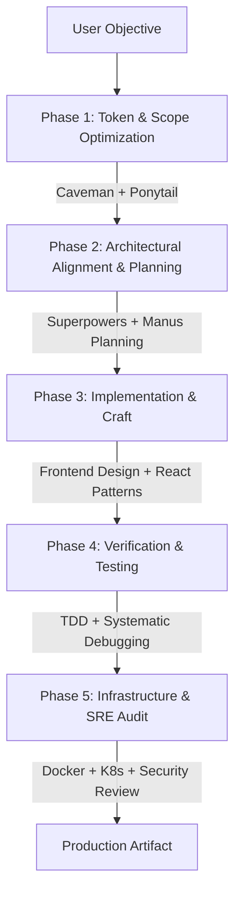

# All-in-One Skills for AI (`all-in-one-skills-for-ai`)

A modular, enterprise-grade suite of 54 production skills compliant with the [Agent Skills Open Specification](https://agentskills.io). Built for cross-agent compatibility across Claude Code, Cursor, Windsurf, GitHub Copilot CLI, Antigravity, and Codex.

---

## Overview

Modern AI coding agents face five systemic failure modes:
1. **Context Bloat**: Verbose reasoning loops that exhaust token budgets and trigger early context truncation.
2. **Premature Complexity**: Defaulting to third-party dependencies and over-engineered abstractions over native platform capabilities.
3. **Aesthetic Homogeneity**: Low-fidelity, generic user interfaces lacking typographic rhythm, intentional color theory, and structural hierarchy.
4. **Context Degradation**: Memory decay across multi-turn sessions leading to regressions and plan drift.
5. **Operational Blindspots**: Generating application code without verifying security parameters, database lock contention, container efficiency, or Kubernetes manifest validity.

This repository resolves these bottlenecks through a modular, composable skills pipeline spanning pre-flight efficiency, high-level system reasoning, UI/UX craft, and infrastructure verification.

---

## Agent Execution Architecture



---

## Skill Directory & Attribution Index

<details open>
<summary><b>1. Token Efficiency and Anti-Over-Engineering</b></summary>
<br>

Focus: Minimize token burn, strip conversational padding, and enforce strict YAGNI constraints.

| Skill | Purpose | Upstream Origin / Author |
| :--- | :--- | :--- |
| `caveman` | Strips conversational glue words, pleasantries, and verbosity while retaining 100% technical fidelity. Reduces token consumption by 65% to 75%. | [Julius Brussee](https://github.com/JuliusBrussee/caveman) |
| `caveman-commit` | Formats dense, conventional git commit messages without explanatory conversational metadata. | [Julius Brussee](https://github.com/JuliusBrussee/caveman) |
| `caveman-compress` | Compresses historical conversation context, tracebacks, and log dumps into structured, high-density briefs. | [Julius Brussee](https://github.com/JuliusBrussee/caveman) |
| `caveman-optimize` | Systematically audits prompts and context payloads to reduce multi-turn context expansion. | [Julius Brussee](https://github.com/JuliusBrussee/caveman) |
| `ponytail` | Enforces the "Ladder of Laziness" to stop over-engineering: YAGNI -> Codebase Reuse -> Standard Library -> Platform Native -> Minimal Diff. | [Dietrich Gebert](https://github.com/DietrichGebert/ponytail) |
| `ponytail-audit` | Audits projects for dependency sprawl, bloated packages, and superfluous abstractions. | [Dietrich Gebert](https://github.com/DietrichGebert/ponytail) |
| `ponytail-debt` | Evaluates architectural debt and premature abstractions prior to feature development. | [Dietrich Gebert](https://github.com/DietrichGebert/ponytail) |
| `investigate-first` | Blocks immediate file mutations; mandates root-cause isolation and impact analysis prior to edits. | [Dietrich Gebert](https://github.com/DietrichGebert/ponytail) |
| `lean-build` | Minimalist build and bundle strategies prioritizing platform primitives and zero-dependency patterns. | [Dietrich Gebert](https://github.com/DietrichGebert/ponytail) |
| `safe-refactor` | Incremental refactoring guidelines ensuring backward compatibility and regression bounds. | [Dietrich Gebert](https://github.com/DietrichGebert/ponytail) |
| `surgical-patch` | Restricts code changes to atomic, localized line ranges rather than full-file replacements. | [Dietrich Gebert](https://github.com/DietrichGebert/ponytail) |
| `verify-and-stop` | Defines deterministic criteria to cease agent execution once requirements are satisfied. | [Dietrich Gebert](https://github.com/DietrichGebert/ponytail) |

</details>

<details open>
<summary><b>2. UI/UX and Frontend Design Systems</b></summary>
<br>

Focus: Elevate AI-generated interfaces through curated design tokens, dynamic typography, and spatial scales.

| Skill | Purpose | Upstream Origin / Author |
| :--- | :--- | :--- |
| `frontend-design` | Overrides generic AI UI conventions; establishes distinct color palettes, font pairings, spatial tension, and layout systems. | [Anthropic](https://github.com/anthropics/skills) |
| `ui-ux-pro-max` | Comprehensive design intelligence database covering 57 UI paradigms, 95 industry palettes, and micro-interaction heuristics. | [NextLevelBuilder](https://github.com/nextlevelbuilder/ui-ux-pro-max-skill) |
| `design-system` | Generates tokenized CSS variables, typography ladders, fluid spacing scales, and reusable component contracts. | [NextLevelBuilder](https://github.com/nextlevelbuilder/ui-ux-pro-max-skill) |
| `ui-styling` | Production utility CSS and Tailwind configurations with responsiveness and dark-mode tokens. | [NextLevelBuilder](https://github.com/nextlevelbuilder/ui-ux-pro-max-skill) |
| `brand` | Enforces visual brand guidelines, asset dimensions, typography hierarchy, and tone consistency. | [NextLevelBuilder](https://github.com/nextlevelbuilder/ui-ux-pro-max-skill) |
| `banner-design` | Computes responsive layout hierarchies, visual weights, and hero asset specifications. | [NextLevelBuilder](https://github.com/nextlevelbuilder/ui-ux-pro-max-skill) |
| `react-patterns` | Idiomatic React patterns: hook boundaries, state colocation, context splitting, and render optimizations. | Community Core |
| `nextjs-best-practices` | App Router architecture, React Server Components (RSC), boundary orchestration, and streaming data patterns. | Vercel / Next.js Ecosystem |

</details>

<details open>
<summary><b>3. Architecture, Reasoning and Complex Project Planning</b></summary>
<br>

Focus: Shift from ad-hoc prompting to disciplined engineering workflows, formal planning, and test-first verification.

| Skill | Purpose | Upstream Origin / Author |
| :--- | :--- | :--- |
| `brainstorming` | Explores problem spaces, evaluates architectural alternatives, and aligns requirements prior to coding. | [Jesse Vincent (obra)](https://github.com/obra/superpowers) |
| `writing-plans` | Formulates step-by-step technical blueprints with explicit verification criteria for each phase. | [Jesse Vincent (obra)](https://github.com/obra/superpowers) |
| `executing-plans` | Executes technical implementation plans sequentially, confirming passing states at every milestone. | [Jesse Vincent (obra)](https://github.com/obra/superpowers) |
| `subagent-driven-development` | Breaks down complex objectives and delegates atomic, isolated deliverables to specialized subagents. | [Jesse Vincent (obra)](https://github.com/obra/superpowers) |
| `dispatching-parallel-agents` | Coordinates concurrent execution threads for testing, static analysis, and documentation generation. | [Jesse Vincent (obra)](https://github.com/obra/superpowers) |
| `using-git-worktrees` | Isolates experimental features and agent scratchpads into dedicated git worktrees. | [Jesse Vincent (obra)](https://github.com/obra/superpowers) |
| `verification-before-completion` | Prohibits declaring a task complete without reproducible test or build evidence. | [Jesse Vincent (obra)](https://github.com/obra/superpowers) |
| `requesting-code-review` | Compiles focused, context-aware review packets detailing intent, changes, and verification proof. | [Jesse Vincent (obra)](https://github.com/obra/superpowers) |
| `receiving-code-review` | Systematically parses review comments and refactors code without defensive rationalization. | [Jesse Vincent (obra)](https://github.com/obra/superpowers) |
| `planning-with-files` | Implements persistent markdown memory (`task_plan.md`, `findings.md`) on disk to prevent memory decay. | [Othman Adi](https://github.com/OthmanAdi/planning-with-files) |
| `system-design` | Calculates capacity constraints (QPS, IOPS, bandwidth), evaluates CAP/ACID trade-offs, and documents architectures. | [Pinchen](https://github.com/pinchen147/system-design-skill) |
| `architect-review` | Audits system boundaries, domain models, interface coupling, and high-load failure modes. | Software Architecture Guild |
| `clean-code` | Enforces structural readability, meaningful symbol naming, function purity, and single-responsibility boundaries. | Robert C. Martin ("Uncle Bob") |
| `code-reviewer` | Evaluates pull requests for race conditions, resource leaks, edge-case coverage, and API ergonomics. | Staff Reviewer Guild |
| `systematic-debugging` | 4-phase diagnostic loop: Reproduce -> Isolate Root Cause -> Formulate Hypothesis -> Prove Resolution. | Systems Reliability Guild |
| `test-driven-development` | Enforces the Red-Green-Refactor discipline: tests must fail before code implementation begins. | Kent Beck / TDD Core |
| `tdd-workflow` | Manages test suites across unit, integration, end-to-end, and property-based validation layers. | TDD Frameworks |
| `effective-agent-skills` | Meta-skill for authoring, linting, and evaluating agent skills under the open specification. | [AgentSkills.io](https://agentskills.io) |

</details>

<details open>
<summary><b>4. Backend, Database and DevSecOps</b></summary>
<br>

Focus: Resilient data layers, schema migration safety, security posture, and runtime profiling.

| Skill | Purpose | Upstream Origin / Author |
| :--- | :--- | :--- |
| `database` | Relational and document data modeling, query analysis, index selection, and transaction isolation. | Systems Database Guild |
| `db-review` | Inspects migration scripts for locking behavior, table rewrites, connection exhaustion, and rollback safety. | [Harshhaa](https://github.com/NotHarshhaa/devops-skills) |
| `security-auditor` | Evaluates source code for OWASP Top 10 vulnerabilities, credential leakage, and insecure deserialization. | DevSecOps Guild |
| `security-review` | Audits endpoint authentication, token validation, authorization boundaries, and cryptographic configurations. | [Harshhaa](https://github.com/NotHarshhaa/devops-skills) |
| `performance-profiling` | Profiles CPU, memory allocation, garbage collection pressure, and I/O bottlenecks. | Systems Engineering Guild |
| `powershell-windows` | Cross-platform and Windows PowerShell conventions, trap handling, and robust automation pipelines. | Windows Platform Guild |
| `git-pr-review` | Generates token-efficient pull request summaries directly from git commit graphs and diff trees. | Developer Productivity Guild |
| `debugging-toolkit` | Diagnostic tooling integration for interactive memory examination and core dump analysis. | Systems Diagnostic Guild |

</details>

<details open>
<summary><b>5. DevOps, Cloud, Containers and SRE</b></summary>
<br>

Focus: Infrastructure verification, container hardening, CI/CD pipeline integrity, and incident triage.

| Skill | Purpose | Upstream Origin / Author |
| :--- | :--- | :--- |
| `docker-review` | Hardens Dockerfiles using multi-stage builds, non-root users, layer caching, and minimal base images. | [Harshhaa](https://github.com/NotHarshhaa/devops-skills) |
| `k8s-review` | Validates Kubernetes resources, Helm templates, PodSecurityStandards, resource quotas, and RBAC policies. | [Harshhaa](https://github.com/NotHarshhaa/devops-skills) |
| `terraform-review` | Analyzes Infrastructure as Code (IaC) plans to prevent resource recreation, drift, and insecure security groups. | [Harshhaa](https://github.com/NotHarshhaa/devops-skills) |
| `pipeline-review` | Audits GitHub Actions and CI/CD pipelines for build efficiency, caching strategies, and supply-chain threats. | [Harshhaa](https://github.com/NotHarshhaa/devops-skills) |
| `incident` | SRE live-incident runbook: hypothesis testing, metric correlation, log extraction, and mitigation planning. | [Harshhaa](https://github.com/NotHarshhaa/devops-skills) |
| `observability` | Configures structured logging, Prometheus metric semantics, trace propagation, and alert thresholds. | [Harshhaa](https://github.com/NotHarshhaa/devops-skills) |
| `gitops-review` | Validates ArgoCD and Flux manifests for reconciliation loops, state drift, and target branch protections. | [Harshhaa](https://github.com/NotHarshhaa/devops-skills) |
| `release-readiness` | Pre-deployment verification gate: schema compatibility, canary checks, smoke tests, and rollback strategies. | [Harshhaa](https://github.com/NotHarshhaa/devops-skills) |

</details>

---

## Installation and Deployment

### Global Deployment (Claude Code)

To link all 54 skills into your user-level Claude Code configuration:

```bash
git clone https://github.com/Serion89/all-in-one-skills-for-ai.git
cp -r all-in-one-skills-for-ai/skills/* ~/.claude/skills/
```

### Global Deployment (Antigravity / Gemini CLI)

On Windows (PowerShell):
```powershell
Copy-Item -Path "all-in-one-skills-for-ai\skills\*" -Destination "$HOME\.gemini\config\skills\" -Recurse -Force
```

On Linux or macOS:
```bash
mkdir -p ~/.gemini/config/skills
cp -r all-in-one-skills-for-ai/skills/* ~/.gemini/config/skills/
```

### Automated Workspace Sync

A helper script is provided to automate synchronization across target environments:

```powershell
# Windows PowerShell
.\sync.ps1 -Target all     # Options: claude, gemini, all
```

### Project-Level Deployment (Cursor, Windsurf, Cline)

Copy desired skills directly into your project's agent directory:

```bash
mkdir -p .agents/skills
cp -r path/to/all-in-one-skills-for-ai/skills/frontend-design .agents/skills/
cp -r path/to/all-in-one-skills-for-ai/skills/caveman .agents/skills/
cp -r path/to/all-in-one-skills-for-ai/skills/planning-with-files .agents/skills/
```

---

## Security Policy

- **No Executable Binaries**: All skills are plain Markdown text (`SKILL.md`) structured with YAML frontmatter.
- **No Background Telemetry**: Zero network calls, telemetry beacons, or external dependencies.
- **Transparent Directives**: Every instruction set is human-readable and inspectable prior to activation.

---

## License and Attribution

This meta-repository is curated and maintained by [Serion89](https://github.com/Serion89). 

All upstream skills are credited to their respective original authors and maintainers under their respective open-source licenses (MIT / Apache 2.0). Individual copyright notices and licenses reside within their respective upstream repositories linked in the index above.
