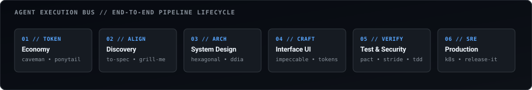
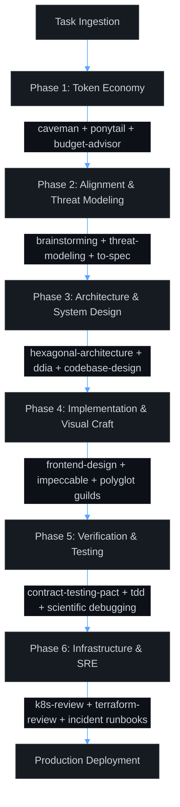

<div align="center">



<p align="center">
  <a href="https://github.com/Serion89/all-in-one-skills-for-ai"></a>
  <a href="https://agentskills.io"></a>
  <a href="#security--verification-standards"></a>
  <a href="#domain-navigation-matrix"></a>
  <a href="https://github.com/Serion89"></a>
  <a href="#license-and-attribution"></a>
</p>

A curated collection of 124 verified agent skills conforming to the open [Agent Skills Specification](https://agentskills.io). Compatible with Claude Code, Cursor, Windsurf, Antigravity, GitHub Copilot CLI, and Cline.

[Environment Setup](#interactive-installation-guide) &bull; [Behavioral Comparison](#default-agent-vs-all-in-one-harness) &bull; [Execution Lifecycle](#agent-execution-lifecycle) &bull; [Operational Playbooks](#operational-playbooks) &bull; [Domain Index](#domain-navigation-matrix) &bull; [Maintainer](#project-maintainer)

</div>

---

## Interactive Installation Guide

Choose your target coding assistant below to copy the direct setup command:

<details open>
<summary><b>Claude Code (~/.claude/skills)</b></summary>
<br>

Installs all 124 skills globally for Claude Code CLI:

```bash
# Clone and copy into Claude Code global skills path
git clone https://github.com/Serion89/all-in-one-skills-for-ai.git
mkdir -p ~/.claude/skills
cp -r all-in-one-skills-for-ai/skills/* ~/.claude/skills/
```

Verify in Claude Code:
```text
/skills
# Output: 124 loaded skills (caveman, ponytail, threat-modeling, hexagonal-architecture, etc.)
```

</details>

<details>
<summary><b>Cursor (.agents/skills or .cursor/rules)</b></summary>
<br>

For project-specific use in Cursor:

```bash
# In your project root
mkdir -p .agents/skills
cp -r path/to/all-in-one-skills-for-ai/skills/threat-modeling .agents/skills/
cp -r path/to/all-in-one-skills-for-ai/skills/caveman .agents/skills/
cp -r path/to/all-in-one-skills-for-ai/skills/frontend-design .agents/skills/
cp -r path/to/all-in-one-skills-for-ai/skills/hexagonal-architecture .agents/skills/
```

Cursor automatically discovers skills located in `.agents/skills` or via custom rules.

</details>

<details>
<summary><b>Windsurf (.agents/skills)</b></summary>
<br>

Windsurf reads agent skills natively from the workspace root:

```bash
# In your workspace root
mkdir -p .agents/skills
cp -r path/to/all-in-one-skills-for-ai/skills/* .agents/skills/
```

</details>

<details>
<summary><b>Antigravity / Gemini CLI (~/.gemini/config/skills)</b></summary>
<br>

**On Windows (PowerShell):**
```powershell
New-Item -ItemType Directory -Path "$HOME\.gemini\config\skills" -Force
Copy-Item -Path "all-in-one-skills-for-ai\skills\*" -Destination "$HOME\.gemini\config\skills\" -Recurse -Force
```

**On Linux or macOS:**
```bash
mkdir -p ~/.gemini/config/skills
cp -r all-in-one-skills-for-ai/skills/* ~/.gemini/config/skills/
```

</details>

<details>
<summary><b>Automated Multi-Environment Sync (sync.ps1)</b></summary>
<br>

The repository includes a cross-platform synchronization script for Windows, macOS, and Linux:

```powershell
# Synchronize to all detected environments (Claude Code, Gemini/Antigravity)
.\sync.ps1 -Target all

# Or synchronize to a specific target
.\sync.ps1 -Target claude
.\sync.ps1 -Target gemini
```

</details>

---

## Default Agent vs. All-in-One Harness

Standard coding agents without defined skills default to recurring failure modes: verbose conversational filler that wastes context tokens, premature third-party package installation, absence of threat boundaries, and lack of rollback plans.

<div align="center">
  
</div>

### Measured Behavioral Differences

| Engineering Vector | Default Agent Behavior | With All-in-One Skills | Concrete Result |
| :--- | :--- | :--- | :--- |
| **Token Consumption** | Conversational filler, full-file re-echoing | `caveman` + `ponytail` + `token-budget-advisor` | **65% to 75% token reduction** |
| **Dependency Control** | Adds npm/pip packages for basic utility tasks | Ladder of Laziness: YAGNI &rarr; Native platform stdlib | **Zero unnecessary dependencies** |
| **Interface Craft** | Generic cards, browser defaults, purple accents | `frontend-design` + `impeccable` + `design-system` | **Tokenized design systems & fluid scales** |
| **Session State** | Context decay across multi-turn sessions | `planning-with-files` (Manus-style disk memory) | **Continuous state preservation on disk** |
| **API Quality** | Ad-hoc endpoints, untested edge cases | `contract-testing-pact` + `graphql` + `grpc` | **Deterministic consumer contracts** |
| **Infrastructure** | Blind configuration generation | SRE runbooks + `k8s-review` + `terraform-review` | **Production-hardened manifests** |
| **Security Auditing** | Implicit trust in client headers | `threat-modeling` (STRIDE) + OWASP API Top 10 | **Mandatory boundary isolation** |

---

## Agent Execution Lifecycle

<div align="center">
  
</div>



---

## Operational Playbooks

Real scenarios showing how skills coordinate during development tasks:

<details open>
<summary><b>Playbook 1: Massive Codebase Refactoring with Minimal Token Burn</b></summary>
<br>

When refactoring complex modules, agents often waste thousands of tokens repeating logs and explanations.

1. **Activate Skills**: `caveman` + `surgical-patch` + `investigate-first`
2. **Behavior**:
   * Agent strips conversational filler words and responds in dense technical telegraphic phrasing.
   * Agent is restricted from rewriting entire 500-line files; changes are scoped strictly to 5-15 line diff ranges.
   * Root-cause investigation is mandated before modifying any source code.
3. **Prompt Example**:
   ```text
   Use caveman and surgical-patch: Refactor the Redis client pool in src/cache/pool.ts to use exponential backoff with jitter.
   ```

</details>

<details>
<summary><b>Playbook 2: Defensive API Endpoint with Consumer Contract Testing</b></summary>
<br>

Building endpoints that handle multi-tenant isolation and verify schema contracts in CI without full staging clusters.

1. **Activate Skills**: `threat-modeling` + `api-security-testing` + `contract-testing-pact`
2. **Behavior**:
   * Analyzes the endpoint against STRIDE threat vectors (BOLA, Broken Object Property Level Auth, SSRF).
   * Validates tenant isolation in SQL/ORM queries to prevent cross-account data leakage.
   * Generates a Pact consumer-driven contract file for consumer and provider verification.
3. **Prompt Example**:
   ```text
   Build the tenant billing webhook endpoint. Use threat-modeling to audit access boundaries and contract-testing-pact for verification.
   ```

</details>

<details>
<summary><b>Playbook 3: Live SRE Incident Triage and Root Cause Isolation</b></summary>
<br>

Handling active production alerts or Kubernetes crash loops under tight incident timelines.

1. **Activate Skills**: `sev1-first-15-minutes` + `diagnose-crashloop` + `incident`
2. **Behavior**:
   * Enforces the 15-minute incident commander protocol: blast radius assessment, containment, and stakeholder status updates.
   * Executes the diagnostic decision tree for container exits (ExitCode 137 OOMKilled vs. ExitCode 1 / CrashLoopBackOff).
   * Formulates structured hypotheses before recommending rollback or configuration changes.
3. **Prompt Example**:
   ```text
   Service payment-worker is CrashLooping in production staging. Use diagnose-crashloop and sev1-first-15-minutes to isolate root cause.
   ```

</details>

<details>
<summary><b>Playbook 4: Eliminating Dependency Sprawl (Ladder of Laziness)</b></summary>
<br>

Preventing agents from importing heavy third-party libraries for simple algorithmic problems.

1. **Activate Skills**: `ponytail` + `lean-build` + `clean-code`
2. **Behavior**:
   * Evaluates the Ladder of Laziness: YAGNI &rarr; Codebase Reuse &rarr; Standard Library &rarr; Platform Native &rarr; Minimal Diff.
   * Rejects installing npm packages for tasks easily solved with native platform APIs (e.g. `node:crypto`, `Intl`, Web Streams).
3. **Prompt Example**:
   ```text
   Use ponytail: Add HMAC token signing to our webhook handler. Strictly zero new dependencies.
   ```

</details>

---

## Domain Navigation Matrix

| Index | Domain Focus | Modules | Jump Link |
| :-: | :--- | :-: | :--- |
| **01** | Token Efficiency & Context Economy | 09 | [Section 01 &rarr;](#01-token-efficiency-and-context-economy-9-skills) |
| **02** | Minimalist Architecture & Anti-Over-Engineering | 06 | [Section 02 &rarr;](#02-minimalist-architecture-and-anti-over-engineering-6-skills) |
| **03** | UI/UX Foundations, Design Systems & Visual Craft | 09 | [Section 03 &rarr;](#03-uiux-foundations-design-systems-and-visual-craft-9-skills) |
| **04** | Frontend Frameworks, Mobile & Web Performance | 05 | [Section 04 &rarr;](#04-frontend-frameworks-mobile-and-web-performance-5-skills) |
| **05** | Ideation, Alignment & Requirement Discovery | 08 | [Section 05 &rarr;](#05-ideation-alignment-and-requirement-discovery-8-skills) |
| **06** | Engineering Planning & Multi-Agent Orchestration | 08 | [Section 06 &rarr;](#06-engineering-planning-task-breakdown-and-multi-agent-orchestration-8-skills) |
| **07** | Architectural Principles, DDD & Classical Literature | 08 | [Section 07 &rarr;](#07-architectural-principles-domain-modeling-and-classical-literature-8-skills) |
| **08** | Testing Disciplines, Code Review & Scientific Debugging | 11 | [Section 08 &rarr;](#08-testing-disciplines-code-review-and-scientific-debugging-11-skills) |
| **09** | Systems Programming & Polyglot Languages | 05 | [Section 09 &rarr;](#09-systems-programming-and-polyglot-languages-5-skills) |
| **10** | Backend Architecture, Distributed Data & Search | 14 | [Section 10 &rarr;](#10-backend-architecture-distributed-data-and-search-14-skills) |
| **11** | Defensive Cybersecurity, Threat Modeling & Safe Stress Testing | 08 | [Section 11 &rarr;](#11-defensive-cybersecurity-threat-modeling-and-safe-stress-testing-8-skills) |
| **12** | DevOps, Cloud Infrastructure, Containers, SRE & Maintenance | 24 | [Section 12 &rarr;](#12-devops-cloud-infrastructure-containers-sre-and-maintenance-24-skills) |
| **13** | Original Engineering Disciplines: ML & Embedded Systems | 02 | [Section 13 &rarr;](#13-original-engineering-disciplines-ml-and-embedded-systems-2-skills) |
| **14** | Original Language, Quality & Platform Skills | 07 | [Section 14 &rarr;](#14-original-language-quality-and-platform-skills-7-skills) |

---

## Granular Skill Directory & Attribution Index (124 Skills)

<details open>
<summary><b>01. Token Efficiency and Context Economy (9 Skills)</b></summary>
<br>

Focus: Strip conversational padding, minimize token burn, and maintain optimal in-memory prompt structures.

| Skill Identifier | Purpose & Capabilities | Upstream Author & Origin |
| :--- | :--- | :--- |
| `caveman` | Ultra-terse communication style. Strips filler words while preserving 100% technical substance. Reduces token consumption by 65% to 75%. | [Julius Brussee](https://github.com/JuliusBrussee/caveman) |
| `caveman-commit` | Formats dense, conventional git commit messages with zero conversational meta-commentary. | [Julius Brussee](https://github.com/JuliusBrussee/caveman) |
| `caveman-compress` | Compresses historical conversation context, tracebacks, and log dumps into structured, high-density briefs. | [Julius Brussee](https://github.com/JuliusBrussee/caveman) |
| `caveman-optimize` | Systematically audits prompts and context payloads to reduce multi-turn context expansion. | [Julius Brussee](https://github.com/JuliusBrussee/caveman) |
| `context-engineering` | Optimizes in-memory prompt structures and token distribution for complex agent tasks. | [Addy Osmani](https://github.com/addyosmani/agent-skills) |
| `token-budget-advisor` | Quantifies prompt cost impact, analyzes token allocation per file, and optimizes payload efficiency. | [Affaan Mustafa (ECC)](https://github.com/affaan-m/ECC) |
| `investigate-first` | Blocks immediate file mutations; mandates root-cause isolation and impact analysis prior to edits. | [Dietrich Gebert](https://github.com/DietrichGebert/ponytail) |
| `verify-and-stop` | Defines deterministic criteria to cease agent execution once requirements are satisfied. | [Dietrich Gebert](https://github.com/DietrichGebert/ponytail) |
| `effective-agent-skills` | Meta-skill for authoring, linting, and evaluating agent skills under the open specification. | [AgentSkills.io](https://agentskills.io) |

</details>

<details open>
<summary><b>02. Minimalist Architecture and Anti-Over-Engineering (6 Skills)</b></summary>
<br>

Focus: Enforce YAGNI principles, prevent dependency sprawl, and produce surgical, atomic code modifications.

| Skill Identifier | Purpose & Capabilities | Upstream Author & Origin |
| :--- | :--- | :--- |
| `ponytail` | Enforces the "Ladder of Laziness" to stop over-engineering: YAGNI &rarr; Codebase Reuse &rarr; Standard Library &rarr; Platform Native &rarr; Minimal Diff. | [Dietrich Gebert](https://github.com/DietrichGebert/ponytail) |
| `ponytail-audit` | Audits codebases for dependency sprawl, oversized npm packages, and superfluous abstractions. | [Dietrich Gebert](https://github.com/DietrichGebert/ponytail) |
| `ponytail-debt` | Evaluates architectural debt and premature abstractions prior to feature development. | [Dietrich Gebert](https://github.com/DietrichGebert/ponytail) |
| `lean-build` | Minimalist build and bundle strategies prioritizing platform primitives and zero-dependency patterns. | [Dietrich Gebert](https://github.com/DietrichGebert/ponytail) |
| `surgical-patch` | Restricts code changes to atomic, localized line ranges rather than full-file rewrites. | [Dietrich Gebert](https://github.com/DietrichGebert/ponytail) |
| `code-simplification` | Reduces code complexity, removes dead branches, and streamlines logic paths for readability. | [Addy Osmani](https://github.com/addyosmani/agent-skills) |

</details>

<details open>
<summary><b>03. UI/UX Foundations, Design Systems and Visual Craft (9 Skills)</b></summary>
<br>

Focus: Establish intentional design tokens, typography ladders, micro-interactions, and accessibility standards.

| Skill Identifier | Purpose & Capabilities | Upstream Author & Origin |
| :--- | :--- | :--- |
| `frontend-design` | Overrides generic AI UI conventions; establishes distinct color palettes, font pairings, spatial tension, and layout systems. | [Anthropic](https://github.com/anthropics/skills) |
| `impeccable` | Award-winning design director toolkit covering 20+ specialized playbooks: audits, micro-interactions, typography, and polish. | [Paul Bakaus](https://github.com/pbakaus/impeccable) |
| `liquid-glass-design` | Advanced glassmorphism paradigms: backdrop blur layers, border reflections, fluid depth, and dark-mode lighting. | [Affaan Mustafa (ECC)](https://github.com/affaan-m/ECC) |
| `ui-ux-pro-max` | Comprehensive design intelligence database covering 57 UI paradigms, 95 industry palettes, and micro-interaction heuristics. | [NextLevelBuilder](https://github.com/nextlevelbuilder/ui-ux-pro-max-skill) |
| `design-system` | Generates tokenized CSS variables, typography ladders, fluid spacing scales, and reusable component contracts. | [NextLevelBuilder](https://github.com/nextlevelbuilder/ui-ux-pro-max-skill) |
| `ui-styling` | Production utility CSS and Tailwind configurations with responsiveness and dark-mode tokens. | [NextLevelBuilder](https://github.com/nextlevelbuilder/ui-ux-pro-max-skill) |
| `brand` | Enforces visual brand guidelines, asset dimensions, typography hierarchy, and tone consistency. | [NextLevelBuilder](https://github.com/nextlevelbuilder/ui-ux-pro-max-skill) |
| `banner-design` | Computes responsive layout hierarchies, visual weights, and hero asset specifications. | [NextLevelBuilder](https://github.com/nextlevelbuilder/ui-ux-pro-max-skill) |
| `accessibility-wcag-compliance` | Web accessibility engineering compliant with WCAG 2.2 Level AA: focus management, ARIA landmark roles, semantic heading order, and contrast verification. | [W3C / Web Accessibility Initiative](https://www.w3.org/WAI/standards-guidelines/wcag/) |

</details>

<details open>
<summary><b>04. Frontend Frameworks, Mobile and Web Performance (5 Skills)</b></summary>
<br>

Focus: Component composition, cross-platform mobile patterns, and Google Core Web Vitals optimization.

| Skill Identifier | Purpose & Capabilities | Upstream Author & Origin |
| :--- | :--- | :--- |
| `react-patterns` | Idiomatic React composition: custom hook boundaries, state colocation, context splitting, and render optimizations. | Community Core |
| `nextjs-best-practices` | App Router architecture, React Server Components (RSC), boundary orchestration, and streaming data patterns. | Vercel / Next.js Ecosystem |
| `react-native-patterns` | Production React Native & Expo cross-platform patterns: Hermes engine optimization, FlashList virtualization, and native Reanimated gesture threads. | [Shopify & Expo Mobile Guild](https://github.com/facebook/react-native) |
| `web-performance-core-vitals` | Frontend optimization for Google Core Web Vitals: LCP hero preloading, INP event-loop yielding, and CLS layout stability. | [Google Chrome Performance Team](https://web.dev/vitals/) |
| `browser-testing-with-devtools` | Automates Chrome DevTools inspection for layout shifts, accessibility defects, and render performance. | [Addy Osmani](https://github.com/addyosmani/agent-skills) |

</details>

<details open>
<summary><b>05. Ideation, Alignment and Requirement Discovery (8 Skills)</b></summary>
<br>

Focus: Interrogate ambiguous product needs, surface hidden assumptions, and formulate formal engineering specifications.

| Skill Identifier | Purpose & Capabilities | Upstream Author & Origin |
| :--- | :--- | :--- |
| `brainstorming` | Explores problem spaces, evaluates architectural alternatives, and aligns requirements prior to coding. | [Jesse Vincent (obra)](https://github.com/obra/superpowers) |
| `idea-refine` | Sharpens abstract feature ideas into structured engineering proposals. | [Addy Osmani](https://github.com/addyosmani/agent-skills) |
| `interview-me` | Conducts stakeholder discovery interviews to surface implicit business requirements. | [Addy Osmani](https://github.com/addyosmani/agent-skills) |
| `grill-me` | Interactive interview loop that challenges hidden assumptions and edge cases before implementation. | [Matt Pocock](https://github.com/mattpocock/skills) |
| `to-spec` | Interrogates ambiguous product requirements and transforms them into strict, testable specifications. | [Matt Pocock](https://github.com/mattpocock/skills) |
| `spec-driven-development` | Enforces engineering specifications as the single source of truth prior to code generation. | [Addy Osmani](https://github.com/addyosmani/agent-skills) |
| `to-tickets` | Decomposes technical specifications into atomic, dependency-sequenced engineering tickets. | [Matt Pocock](https://github.com/mattpocock/skills) |
| `documentation-and-adrs` | Generates Architectural Decision Records (ADRs) and living system documentation. | [Addy Osmani](https://github.com/addyosmani/agent-skills) |

</details>

<details open>
<summary><b>06. Engineering Planning, Task Breakdown and Multi-Agent Orchestration (8 Skills)</b></summary>
<br>

Focus: Persistent memory on disk, sequential plan execution, and distributed subagent delegation.

| Skill Identifier | Purpose & Capabilities | Upstream Author & Origin |
| :--- | :--- | :--- |
| `writing-plans` | Formulates step-by-step technical blueprints with explicit verification criteria for each phase. | [Jesse Vincent (obra)](https://github.com/obra/superpowers) |
| `executing-plans` | Executes technical implementation plans sequentially, confirming passing states at every milestone. | [Jesse Vincent (obra)](https://github.com/obra/superpowers) |
| `planning-with-files` | Implements persistent markdown memory (`task_plan.md`, `findings.md`) on disk to prevent memory decay. | [Othman Adi](https://github.com/OthmanAdi/planning-with-files) |
| `incremental-implementation` | Delivers complex systems in small, independently verifiable commits. | [Addy Osmani](https://github.com/addyosmani/agent-skills) |
| `subagent-driven-development` | Breaks down complex objectives and delegates atomic, isolated deliverables to specialized subagents. | [Jesse Vincent (obra)](https://github.com/obra/superpowers) |
| `dispatching-parallel-agents` | Coordinates concurrent execution threads for testing, static analysis, and documentation generation. | [Jesse Vincent (obra)](https://github.com/obra/superpowers) |
| `using-git-worktrees` | Isolates experimental features and agent scratchpads into dedicated git worktrees. | [Jesse Vincent (obra)](https://github.com/obra/superpowers) |
| `verification-before-completion` | Prohibits declaring a task complete without reproducible test or build evidence. | [Jesse Vincent (obra)](https://github.com/obra/superpowers) |

</details>

<details open>
<summary><b>07. Architectural Principles, Domain Modeling and Classical Literature (8 Skills)</b></summary>
<br>

Focus: Ground systems in domain boundaries, deep modular encapsulation, and classic engineering literature.

| Skill Identifier | Purpose & Capabilities | Upstream Author & Origin |
| :--- | :--- | :--- |
| `domain-modeling` | Models domain entities, aggregate roots, value objects, and invariant boundaries under DDD principles. | [Matt Pocock](https://github.com/mattpocock/skills) |
| `codebase-design` | Establishes high-cohesion, low-coupling directory layouts and public interface contracts. | [Matt Pocock](https://github.com/mattpocock/skills) |
| `hexagonal-architecture` | Ports and Adapters architecture: decouples business domain core from driving and driven infrastructure adapters. | [Affaan Mustafa / Cockburn](https://github.com/affaan-m/ECC) |
| `philosophy-of-software-design` | John Ousterhout's principles: deep modules with simple interfaces, information hiding, and defining errors out of existence. | [Ciembor / Ousterhout](https://github.com/ciembor/agent-rules-books) |
| `pragmatic-programmer` | Craftsmanship principles: tracer bullets, orthogonality, broken windows, DRY, and deliberate engineering habits. | [Ciembor / Hunt & Thomas](https://github.com/ciembor/agent-rules-books) |
| `clean-code` | Enforces structural readability, meaningful symbol naming, function purity, and single-responsibility boundaries. | Robert C. Martin ("Uncle Bob") |
| `architect-review` | Audits system boundaries, domain models, interface coupling, and high-load failure modes. | Software Architecture Guild |
| `constraint-driven-development` | Solves problems within strict runtime constraints (latency, memory, backwards compatibility). | [Addy Osmani](https://github.com/addyosmani/agent-skills) |

</details>

<details open>
<summary><b>08. Testing Disciplines, Code Review and Scientific Debugging (11 Skills)</b></summary>
<br>

Focus: Red-Green-Refactor test loops, consumer contracts, rigorous peer review, and 4-phase scientific root-cause isolation.

| Skill Identifier | Purpose & Capabilities | Upstream Author & Origin |
| :--- | :--- | :--- |
| `test-driven-development` | Enforces the Red-Green-Refactor discipline: tests must fail before code implementation begins. | Kent Beck / TDD Core |
| `tdd-workflow` | Manages test suites across unit, integration, end-to-end, and property-based validation layers. | TDD Frameworks |
| `contract-testing-pact` | Consumer-driven contract testing (Pact): verifies API contracts between microservices in CI without end-to-end environment dependencies. | [Pact Foundation](https://pact.io/) |
| `code-reviewer` | Evaluates pull requests for race conditions, resource leaks, edge-case coverage, and API ergonomics. | Staff Reviewer Guild |
| `requesting-code-review` | Compiles focused, context-aware review packets detailing intent, changes, and verification proof. | [Jesse Vincent (obra)](https://github.com/obra/superpowers) |
| `receiving-code-review` | Systematically parses review comments and refactors code without defensive rationalization. | [Jesse Vincent (obra)](https://github.com/obra/superpowers) |
| `systematic-debugging` | 4-phase diagnostic loop: Reproduce &rarr; Isolate Root Cause &rarr; Formulate Hypothesis &rarr; Prove Resolution. | Systems Reliability Guild |
| `debugging-toolkit` | Diagnostic tooling integration for interactive memory examination and core dump analysis. | Systems Diagnostic Guild |
| `triage` | Systematically reproduces bug reports, isolates environments, and establishes minimal failure cases. | [Matt Pocock](https://github.com/mattpocock/skills) |
| `doubt-driven-development` | Actively stress-tests agent hypotheses with critical skepticism before committing changes. | [Addy Osmani](https://github.com/addyosmani/agent-skills) |
| `source-driven-development` | Grounds all agent modifications strictly in verifiable source code evidence. | [Addy Osmani](https://github.com/addyosmani/agent-skills) |

</details>

<details open>
<summary><b>09. Systems Programming and Polyglot Languages (5 Skills)</b></summary>
<br>

Focus: Idiomatic language models, memory safety, RAII, concurrency, and high-throughput backends.

| Skill Identifier | Purpose & Capabilities | Upstream Author & Origin |
| :--- | :--- | :--- |
| `rust-pro` | Idiomatic Rust 1.75+: borrow checker navigation, RAII, lifetime elision, Tokio async runtimes, and unsafe encapsulation. | Systems Programming Guild |
| `cpp-pro` | Modern C++20/C++23: RAII, move semantics, smart pointers, concept constraints, and STL algorithm dispatch. | Modern C++ Architecture Guild |
| `c-pro` | Strict C11 memory safety, pointer arithmetic bounds, manual allocation tracking, and POSIX compliance. | Low-Level Systems Guild |
| `golang-patterns` | Idiomatic Go concurrency: goroutine lifecycle management, channel topologies, context cancellation, and error groups. | [Affaan Mustafa / Go Guild](https://github.com/affaan-m/ECC) |
| `fastapi-patterns` | High-throughput Python: Pydantic v2 validation, asynchronous dependency injection, and OpenAPI 3.1 generation. | [Affaan Mustafa / Python Guild](https://github.com/affaan-m/ECC) |

</details>

<details open>
<summary><b>10. Backend Architecture, Distributed Data and Search (14 Skills)</b></summary>
<br>

Focus: Event streaming, transactional outbox, GraphQL federation, sub-millisecond gRPC, distributed caching, and search indices.

| Skill Identifier | Purpose & Capabilities | Upstream Author & Origin |
| :--- | :--- | :--- |
| `data-intensive-applications` | Martin Kleppmann's DDIA principles: explicit consistency semantics, partition keys, replication lag, and stream processing. | [Ciembor / Kleppmann](https://github.com/ciembor/agent-rules-books) |
| `system-design` | Calculates capacity constraints (QPS, IOPS, bandwidth), evaluates CAP/ACID trade-offs, and documents architectures. | [Pinchen](https://github.com/pinchen147/system-design-skill) |
| `latency-critical-systems` | Zero-allocation techniques, cache-line alignment, lock-free ring buffers, and batching heuristics for sub-millisecond systems. | [Affaan Mustafa (ECC)](https://github.com/affaan-m/ECC) |
| `event-driven-architecture` | Distributed event streaming: Transactional Outbox pattern, idempotent consumer deduplication, schema evolution, and dead-letter queues. | [Apache Kafka & RabbitMQ Architecture Guild](https://kafka.apache.org/) |
| `graphql-schema-design` | Enterprise GraphQL: input union patterns, solving N+1 queries via DataLoader, cursor-based pagination, and query complexity bounds. | [GraphQL Foundation & Apollo](https://graphql.org/) |
| `grpc-protobuf-design` | High-performance gRPC over HTTP/2 and proto3: field reservation rules, rich error status details, and deadline propagation. | [gRPC & Protocol Buffers Guild](https://grpc.io/) |
| `websocket-realtime-patterns` | Bidirectional WebSocket & SSE streaming: heartbeat ping/pong, reconnect backoff with jitter, and horizontal Redis Pub/Sub scaling. | [Real-Time Systems Guild](https://developer.mozilla.org/en-US/docs/Web/API/WebSockets_API) |
| `mcp-server-patterns` | Model Context Protocol engineering: JSON-RPC request-response cycles, tool registrations, SSE transports, and schema validation. | [Affaan Mustafa (ECC)](https://github.com/affaan-m/ECC) |
| `api-and-interface-design` | Designs resilient REST, RPC, and GraphQL interfaces with idempotency, versioning, and rate limiting. | [Addy Osmani](https://github.com/addyosmani/agent-skills) |
| `database` | Relational and document data modeling, query analysis, index selection, and transaction isolation. | Systems Database Guild |
| `db-review` | Inspects migration scripts for locking behavior, table rewrites, connection exhaustion, and rollback safety. | [Harshhaa](https://github.com/NotHarshhaa/devops-skills) |
| `postgres-patterns` | Advanced PostgreSQL: B-tree/GIN/BRIN indexing, EXPLAIN ANALYZE interpretation, jsonb operations, and connection pooling. | [Affaan Mustafa (ECC)](https://github.com/affaan-m/ECC) |
| `redis-patterns` | Redis data structures, distributed locking with Lua scripts, pipeline batching, Pub/Sub channels, and cache eviction strategies. | [Affaan Mustafa (ECC)](https://github.com/affaan-m/ECC) |
| `search-and-indexing-patterns` | Full-text search architecture: PostgreSQL native tsvector/GIN indexing, Elasticsearch zero-downtime aliases, and BM25 relevance tuning. | [Elasticsearch & Meilisearch Guild](https://www.elastic.co/) |

</details>

<details open>
<summary><b>11. Defensive Cybersecurity, Threat Modeling and Safe Stress Testing (8 Skills)</b></summary>
<br>

Focus: STRIDE-A threat modeling, OWASP API Top 10 verification, safe load/breakpoint benchmarks, resilience faults, and supply chain integrity.

| Skill Identifier | Purpose & Capabilities | Upstream Author & Origin |
| :--- | :--- | :--- |
| `threat-modeling` | STRIDE-A threat modeling methodology: maps trust boundaries, analyzes privilege escalation vectors, and scores risks via DREAD. | [Microsoft & OWASP Threat Dragon](https://owasp.org/www-project-threat-dragon/) |
| `defensive-stress-testing` | Safe developer load, stress, and breakpoint testing via k6/Locust: determines memory/connection saturation and P99 latency bounds. | [k6 Performance Engineering](https://k6.io/docs/) |
| `api-security-testing` | Audits REST/GraphQL endpoints against OWASP API Top 10 (BOLA, mass assignment, broken auth, SSRF, and CORS origins). | [OWASP API Security Project](https://owasp.org/www-project-api-security/) |
| `chaos-engineering` | Resilience validation and controlled fault injection (latency simulation, worker dropouts, circuit breaker trip tests). | [Principles of Chaos Engineering](https://principlesofchaos.org/) |
| `secret-leak-prevention` | Scans git trees and pre-commit diffs for committed API keys, private tokens, and credentials via Gitleaks/TruffleHog rules. | [Gitleaks Project](https://github.com/gitleaks/gitleaks) |
| `supply-chain-security` | Software supply chain defense: deterministic lockfile enforcement, SBOM generation (CycloneDX/SPDX), and malicious script blocking. | [CycloneDX & OpenSSF](https://cyclonedx.org/) |
| `security-auditor` | DevSecOps static analysis checklist for OWASP Top 10 web vulnerabilities, SQLi, XSS, and authorization leaks. | DevSecOps Guild |
| `security-review` | Audits endpoint authentication, token validation, authorization boundaries, and cryptographic configurations. | [Harshhaa](https://github.com/NotHarshhaa/devops-skills) |

</details>

<details open>
<summary><b>12. DevOps, Cloud Infrastructure, Containers, SRE and Maintenance (24 Skills)</b></summary>
<br>

Focus: Infrastructure verification, production stability patterns, container hardening, CI/CD pipeline integrity, and live SRE incident triage.

| Skill Identifier | Purpose & Capabilities | Upstream Author & Origin |
| :--- | :--- | :--- |
| `production-stability-release-it` | Michael Nygard's Release It! patterns: circuit breakers, bulkheads, timeouts, steady state, and fail-fast architectures. | [Ciembor / Nygard](https://github.com/ciembor/agent-rules-books) |
| `docker-review` | Hardens Dockerfiles using multi-stage builds, non-root users, layer caching, and minimal base images. | [Harshhaa](https://github.com/NotHarshhaa/devops-skills) |
| `k8s-review` | Validates Kubernetes resources, Helm templates, PodSecurityStandards, resource quotas, and RBAC policies. | [Harshhaa](https://github.com/NotHarshhaa/devops-skills) |
| `terraform-review` | Analyzes Infrastructure as Code (IaC) plans to prevent resource recreation, drift, and insecure security groups. | [Harshhaa](https://github.com/NotHarshhaa/devops-skills) |
| `pipeline-review` | Audits GitHub Actions and CI/CD pipelines for build efficiency, caching strategies, and supply-chain threats. | [Harshhaa](https://github.com/NotHarshhaa/devops-skills) |
| `gitops-review` | Validates ArgoCD and Flux manifests for reconciliation loops, state drift, and target branch protections. | [Harshhaa](https://github.com/NotHarshhaa/devops-skills) |
| `release-readiness` | Pre-deployment verification gate: schema compatibility, canary checks, smoke tests, and rollback strategies. | [Harshhaa](https://github.com/NotHarshhaa/devops-skills) |
| `shipping-and-launch` | Production launch checklist covering feature flags, smoke tests, and operational monitors. | [Addy Osmani](https://github.com/addyosmani/agent-skills) |
| `incident` | SRE live-incident runbook: hypothesis testing, metric correlation, log extraction, and mitigation planning. | [Harshhaa](https://github.com/NotHarshhaa/devops-skills) |
| `observability` | Configures structured logging, Prometheus metric semantics, trace propagation, and alert thresholds. | [Harshhaa](https://github.com/NotHarshhaa/devops-skills) |
| `git-pr-review` | Generates token-efficient pull request summaries directly from git commit graphs and diff trees. | Developer Productivity Guild |
| `resolving-merge-conflicts` | Structured protocol for diagnosing and resolving complex three-way git merge conflicts. | [Matt Pocock](https://github.com/mattpocock/skills) |
| `wayfinder` | Navigates unfamiliar codebases with architectural reconnaissance and dependency graphing. | [Matt Pocock](https://github.com/mattpocock/skills) |
| `safe-refactor` | Incremental refactoring guidelines ensuring backward compatibility and regression bounds. | [Dietrich Gebert](https://github.com/DietrichGebert/ponytail) |
| `legacy-code-refactoring` | Michael Feathers's principles: finding code seams, writing characterization tests, and breaking dependencies safely. | [Ciembor / Feathers](https://github.com/ciembor/agent-rules-books) |
| `deprecation-and-migration` | Manages graceful API deprecation cycles, migration paths, and backwards-compatible adapters. | [Addy Osmani](https://github.com/addyosmani/agent-skills) |
| `performance-profiling` | Profiles CPU, memory allocation, garbage collection pressure, and I/O bottlenecks. | Systems Engineering Guild |
| `powershell-windows` | Cross-platform and Windows PowerShell conventions, trap handling, and robust automation pipelines. | Windows Platform Guild |
| `diagnose-crashloop` | SRE runbook for diagnosing Kubernetes CrashLoopBackOff, container exits, and OOMKilled events. | [Arie Bregman](https://github.com/bregman-arie/devops-sre-skills) |
| `sev1-first-15-minutes` | Incident commander protocol for high-severity outages: containment, blast radius assessment, and status pages. | [Arie Bregman](https://github.com/bregman-arie/devops-sre-skills) |
| `triage-cost-spike` | Investigates sudden cloud infrastructure cost increases across compute, network egress, and storage. | [Arie Bregman](https://github.com/bregman-arie/devops-sre-skills) |
| `triage-error-budget-burn` | Audits SLO/SLI error budget consumption and triggers automated release freezes if thresholds breach. | [Arie Bregman](https://github.com/bregman-arie/devops-sre-skills) |
| `triage-latency-regression` | Isolates backend latency spikes across microservices, database connection queues, and external APIs. | [Arie Bregman](https://github.com/bregman-arie/devops-sre-skills) |
| `recover-state-lock` | Safely diagnoses and unlocks corrupted or stale Terraform state locks without data loss. | [Arie Bregman](https://github.com/bregman-arie/devops-sre-skills) |

</details>

---

## 13. Original Engineering Disciplines: ML and Embedded Systems (2 Skills)

<details open>
<summary><b>13. Original Engineering Disciplines (2 Skills)</b></summary>
<br>

Focus: Original skills by [Serion89](https://github.com/Serion89) for disciplines with no existing coverage in this collection: production machine learning and firmware on microcontrollers.

| Skill | Purpose | Credit |
| :--- | :--- | :--- |
| `ml-engineering` | Leakage-safe splits, reproducible training, decision-aligned evaluation, rollout gates, and drift monitoring. | [Serion89](https://github.com/Serion89) |
| `embedded-systems-engineering` | Firmware under real-time, memory, power, and sensor constraints, with safe states and hardware-in-the-loop tests. | [Serion89](https://github.com/Serion89) |

</details>

---

## 14. Original Language, Quality and Platform Skills (7 Skills)

<details open>
<summary><b>14. Original Language, Quality and Platform Skills (7 Skills)</b></summary>
<br>

Focus: Original skills by [Serion89](https://github.com/Serion89) covering language idioms, concurrency, test reliability, authentication, dependency upgrades, and internationalization, areas that had no dedicated skill in this collection.

| Skill | Purpose | Credit |
| :--- | :--- | :--- |
| `python-patterns` | Idiomatic Python: layout, precise typing, exception handling, async safety, logging, subprocess and path safety, pytest. | [Serion89](https://github.com/Serion89) |
| `typescript-patterns` | Type-safe TypeScript and Node.js: strict config, narrowing over casting, discriminated unions, boundary validation, async and shutdown. | [Serion89](https://github.com/Serion89) |
| `concurrency-debugging` | Diagnoses data races, lost updates, deadlocks, and async reentrancy, then fixes the design with deterministic regression tests. | [Serion89](https://github.com/Serion89) |
| `flaky-test-triage` | Measures, classifies, and fixes nondeterministic tests; bisects order dependence; sets a quarantine policy with deadlines. | [Serion89](https://github.com/Serion89) |
| `authentication-implementation` | Builds login and sessions correctly: Argon2id, secure cookies, PKCE, refresh rotation with reuse detection, safe password reset and MFA. | [Serion89](https://github.com/Serion89) |
| `dependency-upgrade` | Plans major dependency and runtime upgrades: breaking-change review, characterization tests, staged upgrades, verification and rollout. | [Serion89](https://github.com/Serion89) |
| `internationalization` | Externalized strings, CLDR plurals, Intl formatting, UTC time, logical CSS for RTL, text expansion, pseudo-localization testing. | [Serion89](https://github.com/Serion89) |

</details>

---

## Security & Verification Standards

| Security Requirement | Implementation | Guarantee |
| :--- | :--- | :--- |
| **Zero Opaque Binaries** | Every skill is pure Markdown (`SKILL.md`) structured with YAML frontmatter | 100% human-auditable source code |
| **Zero Telemetry** | No external beacons, tracking pixels, or phone-home network calls | Total air-gap and privacy compliance |
| **Safe Stress Bounds** | Load and resilience testing skills include mandatory local limits | Zero unauthorized external denial-of-service |
| **Transparent Directives** | Every reasoning constraint and prompt instruction is fully inspectable | No hidden prompt injections or silent mutations |

---

## Project Maintainer

<div align="center">
  <a href="https://github.com/Serion89">
    
  </a>
  <br><br>
  <a href="https://github.com/Serion89"></a>
  <a href="https://github.com/Serion89/all-in-one-skills-for-ai"></a>
  <a href="https://github.com/Serion89/all-in-one-skills-for-ai/fork"></a>
</div>

---

## License and Attribution

This meta-repository is curated and maintained by [Sahil Bhatt (@Serion89)](https://github.com/Serion89).

All upstream skills are credited to their respective original authors and maintainers under their open-source licenses (MIT / Apache 2.0). Individual copyright notices and licenses reside within their respective upstream repositories linked in the index above.
